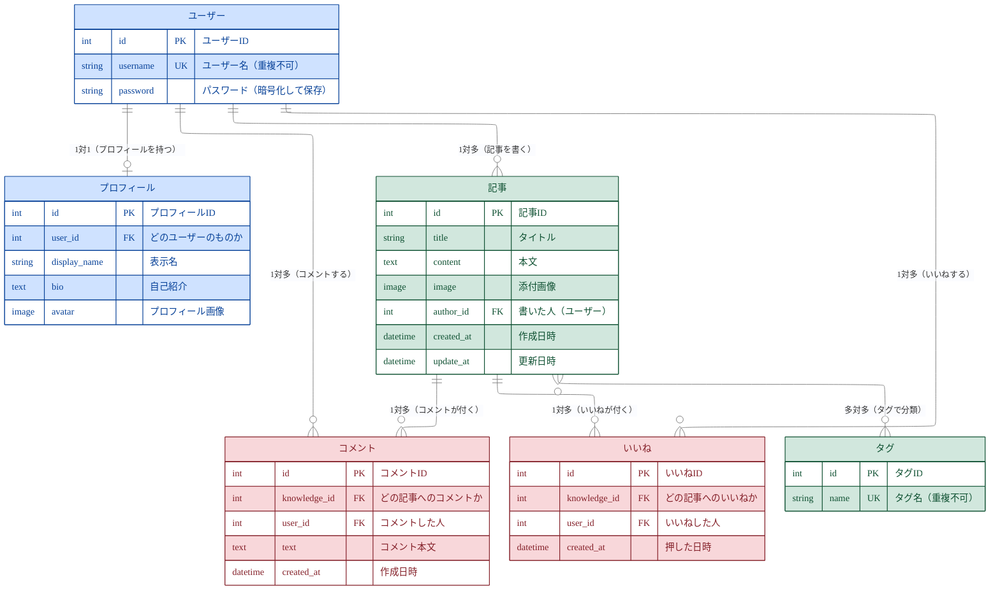

# TechShare ER図（やさしい版）

技術ナレッジ共有アプリ **TechShare** のデータベース設計図（ER図）です。
「この図を初めて見る人」「エンジニア初心者」でも分かるように、
**まず図の読み方** → **全体の図** → **各テーブルの説明** の順でまとめています。

> GitHub や VS Code（Markdown Preview Mermaid Support 拡張）で、そのまま図として表示できます。

---

## 0. はじめに：ER図とは？

**ER図（Entity-Relationship図）** とは、
データベースの中にある「**箱（テーブル）**」と、その「**つながり（関係）**」を表した図です。

- **テーブル**＝Excelのシートのようなもの。1種類のデータを保存する箱。
  - 例）「ユーザー」テーブル、「記事」テーブル
- **行（レコード）**＝そのシートの1行。データ1件分。
  - 例）ユーザー1人分、記事1件分
- **関係（リレーション）**＝テーブル同士のつながり。
  - 例）「1人のユーザーが、たくさんの記事を書く」

---

## 1. 図の読み方（記号のルール）

ER図では、線の端の形で「いくつ対いくつのつながりか」を表します。
TechShareで出てくるのは次の3パターンだけです。

| 線の形 | 意味 | よみ方 | 例 |
|--------|------|--------|-----|
| `||――||` | **1対1** | 1つに対して、必ず1つ | 1人のユーザー ＝ 1つのプロフィール |
| `||――∈` （線が枝分かれ） | **1対多** | 1つに対して、たくさん | 1人のユーザー → たくさんの記事 |
| `∋――∈` （両端が枝分かれ） | **多対多** | お互いにたくさん | 記事 ⇔ タグ |

記号の細かいルール（Mermaid記法）：

- `||`（棒2本）＝「ちょうど1つ」
- `o{`（丸＋枝分かれ）＝「0個以上（たくさんあってもいいし、0でもいい）」
- `o|`（丸＋棒）＝「0または1つ」

> ポイント：**枝分かれしている側が「たくさん」** と覚えると分かりやすいです。

テーブルの中身の記号：

- **PK**（Primary Key / 主キー）＝その行を見分けるための番号。重複しない。だいたい `id`。
- **FK**（Foreign Key / 外部キー）＝別のテーブルの行を指す番号。これでテーブル同士がつながる。
- **UK**（Unique Key / 一意キー）＝同じ値が2つ存在できない列。

---

## 2. 全体のER図

> **色の意味**：🟦 ユーザー系（ユーザー／プロフィール）・🟩 コンテンツ系（記事／タグ）・🟥 反応系（コメント／いいね）

---

## 3. テーブルごとの説明（1つずつ）

### 🟦 ユーザー（user）
アプリにログインする人。Djangoが標準で用意している認証用のテーブルです。
パスワードはそのまま保存されず、暗号化（ハッシュ化）されて入ります。

### 🟦 プロフィール（profile）
ユーザーの「自己紹介・アイコン画像・表示名」を入れる追加情報。
**ユーザー1人につきプロフィール1つ**（＝1対1）なので、線の両端が `1` になっています。

### 🟩 記事（knowledge）
このアプリの主役。投稿された技術ナレッジ1件分です。
**「誰が書いたか」を `author_id` でユーザーとつなげています**（1人がたくさん書けるので1対多）。

### 🟩 タグ（tag）
記事を分類するためのラベル（例：「Python」「初心者」）。
**1つの記事に複数のタグ** を付けられ、**同じタグを複数の記事** で使えるので **多対多** です。
> 多対多のときは、内部に「中間テーブル（`knowledge_tags`）」が自動で作られ、
> 「どの記事に・どのタグが付いているか」の組み合わせを記録しています。

### 🟥 コメント（comment）
記事に対する書き込み。**「どの記事に（`knowledge_id`）」「誰が（`user_id`）」** を持ち、
記事ともユーザーともつながっています。

### 🟥 いいね（like）
記事への「いいね」1件分。**「どの記事に・誰が」** を1行として記録します。
いいねの合計数は、この行を数えれば分かります。
> 同じ人が同じ記事に2回いいねできないよう、`(記事, ユーザー)` の組み合わせを
> **重複禁止（unique制約）** にしています。

---

## 4. まとめ（つながりの一覧）

| つながり | 種類 | ひとことで言うと |
|----------|------|------------------|
| ユーザー ― プロフィール | 1対1 | 1人に1つの自己紹介 |
| ユーザー ― 記事 | 1対多 | 1人がたくさん投稿 |
| ユーザー ― コメント | 1対多 | 1人がたくさんコメント |
| ユーザー ― いいね | 1対多 | 1人がたくさんいいね |
| 記事 ― コメント | 1対多 | 1記事にたくさんコメント |
| 記事 ― いいね | 1対多 | 1記事にたくさんいいね |
| 記事 ― タグ | 多対多 | 1記事に複数タグ・1タグを複数記事で共有 |
