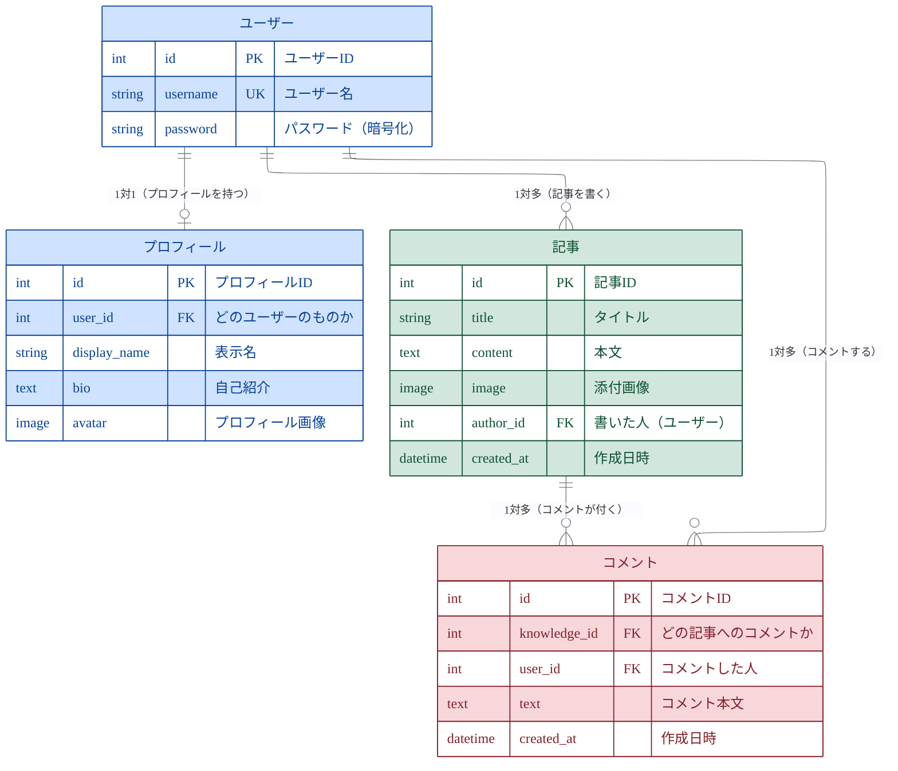

# TechShare ER図（シンプル版・発表用）

データベースが情報をどう管理しているかを **ひと目で** 伝えるための、要点だけに絞ったER図です。
（「いいね」「タグ」は省略し、中心となる4つのテーブルだけを載せています）

---

## 全体のER図

> **色の意味**：🟦 ユーザー系（ユーザー／プロフィール）・🟩 コンテンツ系（記事）・🟥 反応系（コメント）

---

## つながりの一覧

| つながり | 種類 | ひとことで言うと |
|----------|------|------------------|
| ユーザー ― プロフィール | 1対1 | 1人に1つの自己紹介 |
| ユーザー ― 記事 | 1対多 | 1人がたくさん投稿 |
| ユーザー ― コメント | 1対多 | 1人がたくさんコメント |
| 記事 ― コメント | 1対多 | 1記事にたくさんコメント |

---

## 記号の読み方（かんたん）

- **PK**＝主キー。その行を見分ける番号（だいたい `id`）。
- **FK**＝外部キー。別テーブルの行を指す番号。これでテーブル同士がつながる。
- **UK**＝一意キー。同じ値が2つ存在できない列。
- 線の **枝分かれしている側が「たくさん」**。
