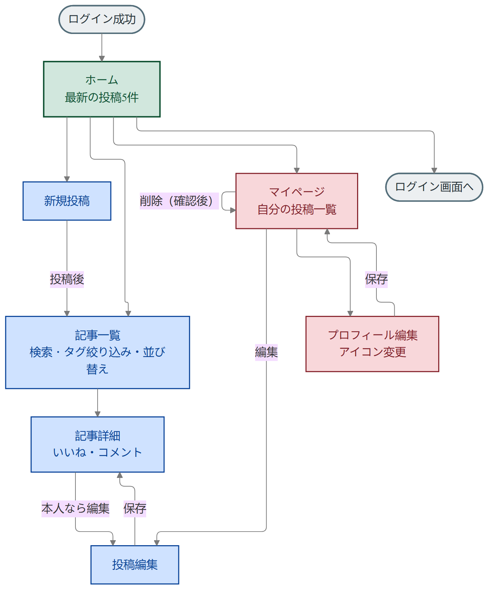
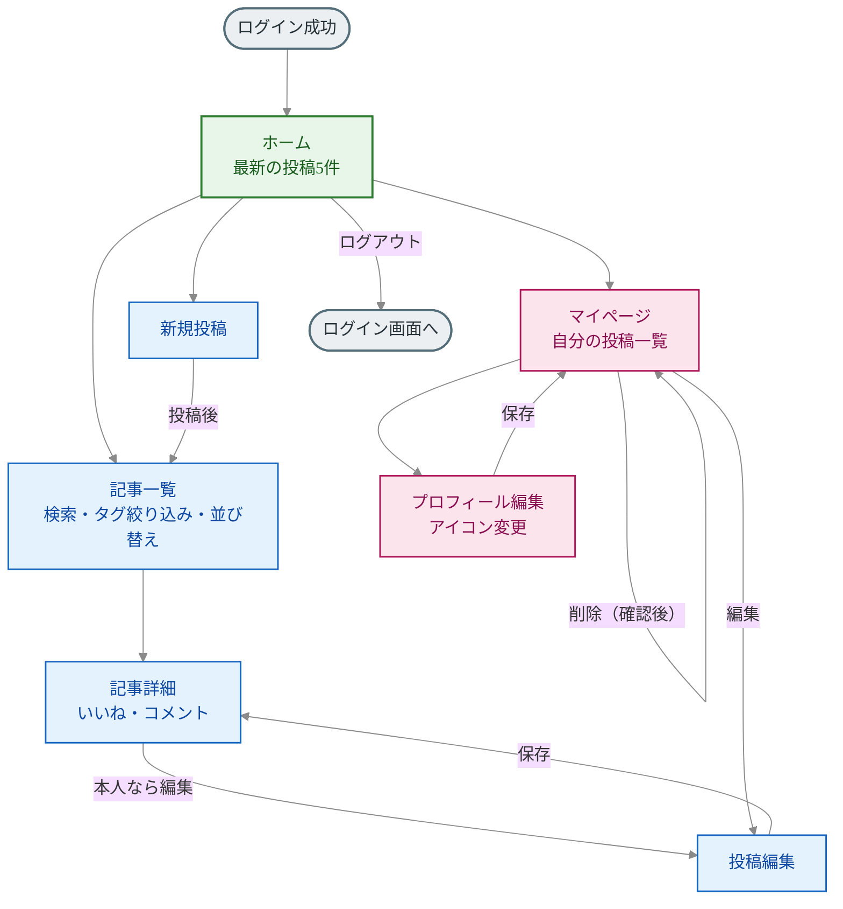

# フロー図（ログイン後の画面遷移）

ログインに成功したあと、アプリ内をどう移動するかをまとめた図。
発表ではこの図をスクリーンショットしてスライドに貼る想定。

> すべての画面に `@login_required` がついているため、未ログインの場合はログイン画面に戻される。

Mermaidソース（編集用）

## ポイント

- 起点はホーム。ここから「記事一覧」「新規投稿」「マイページ」の3方向に分かれる。
- 「いいね」はどの画面（一覧・詳細）から押しても、押した画面にそのまま戻ってくる。
- 投稿の編集は本人だけが可能（`author=request.user` で制限している）。
- 削除はマイページから。確認をはさんでから消す。
