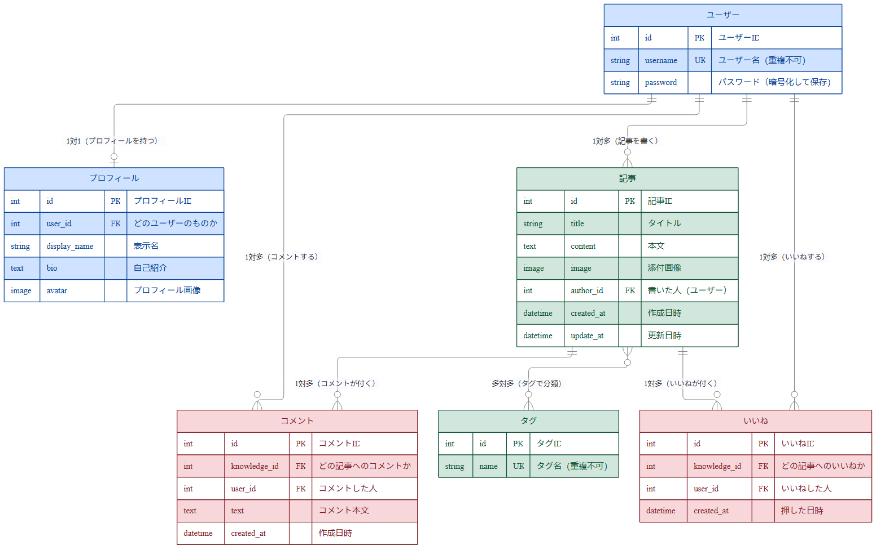
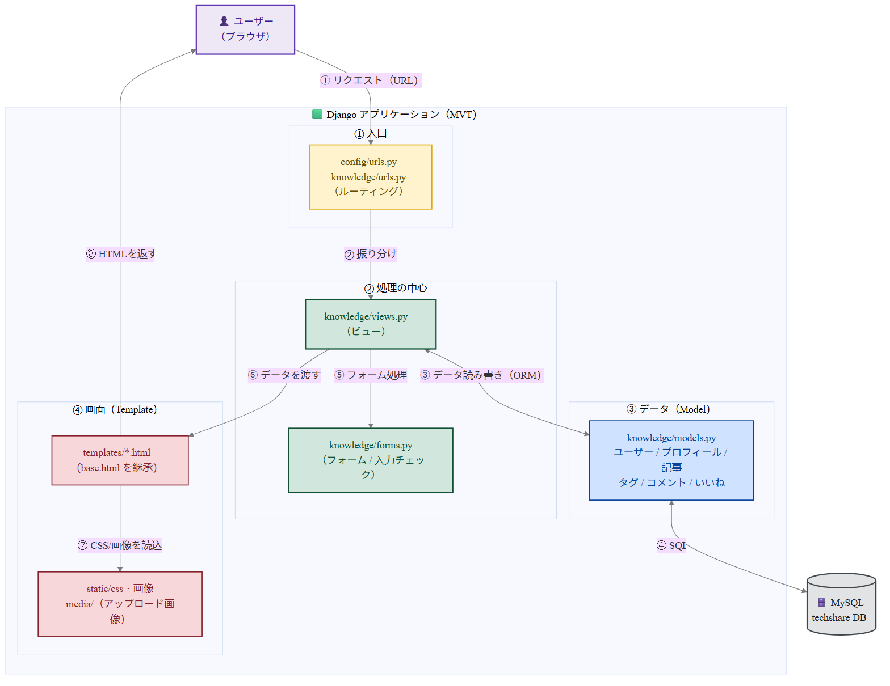
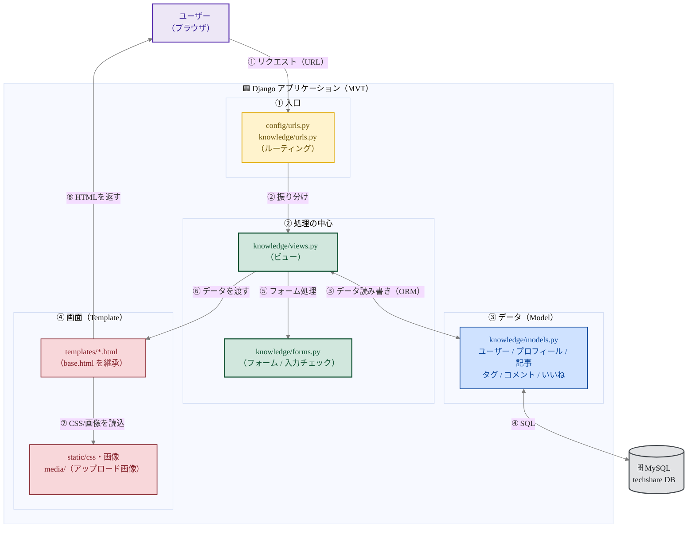
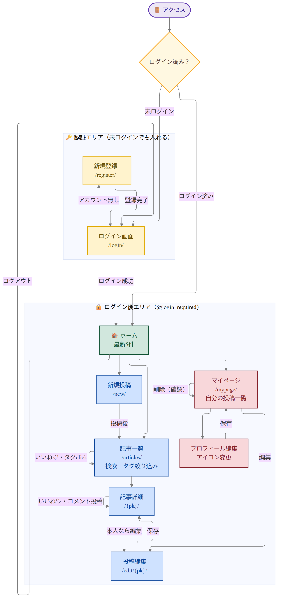
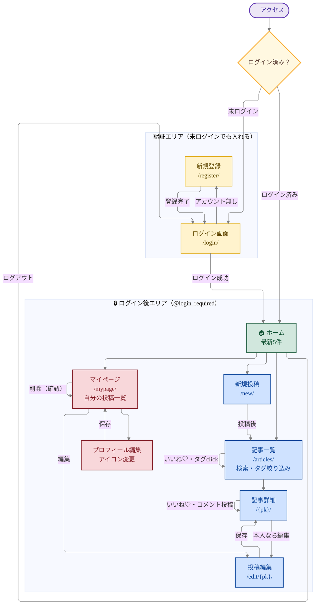
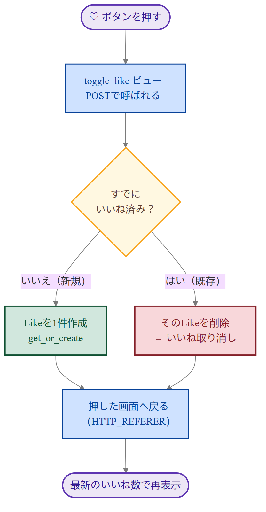
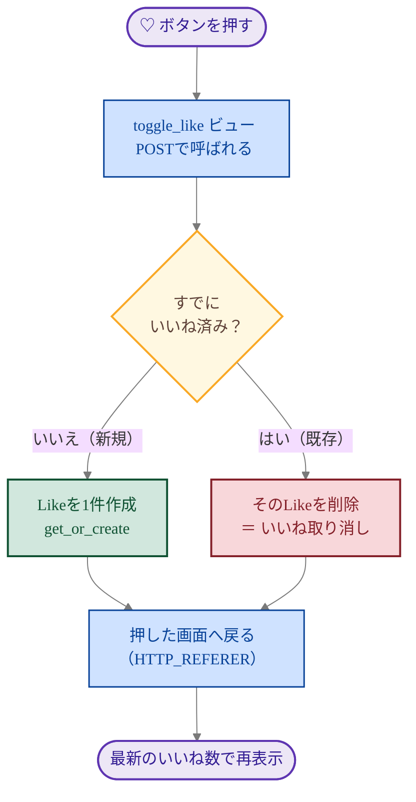

# TechShare 設計図

技術ナレッジ共有アプリ「TechShare」の設計資料。
ER図 / 構成図 / フロー図 の3種類をまとめる。

> GitHub・VS Code（Markdown Preview Mermaid Support）でそのまま図として表示できる。
> 発表ではこの図をスクリーンショットしてスライドに貼る想定。

---

## 1. ER図（データベース設計）

ER図（テーブル構成とその関係）は、初心者向けの解説をつけた専用ファイルに一本化しました。
図の読み方（1対1 / 1対多 / 多対多、PK・FK・UK の意味）から、テーブルごとの説明まで載せています。

📄 **[ER図.md（やさしい版）はこちら](ER図.md)**

> **色の意味**：🟦 ユーザー系（ユーザー／プロフィール）・🟩 コンテンツ系（記事／タグ）・🟥 反応系（コメント／いいね）

---

## 2. 構成図（システム構成・MVT）

DjangoのMVT（Model–View–Template）構成を表す。
ブラウザからのリクエストを `urls.py` が受け取り、対応する `views.py` の関数へ渡す。
ビューは `models.py`（DB）からデータを取り、`templates`（HTML）に渡して画面を作って返す。

> **色の意味**：🟪 ユーザー・🟨 入口（URL）・🟩 処理の中心（View/Form）・🟦 データ（Model）・🟥 画面（Template）・⬜ DB

Mermaidソース（編集用）

**ポイント**
- ビュー（`views.py`）が処理の中心。URL → ビュー → モデル/テンプレート、という流れ。
- DBアクセスは生のSQLではなくDjangoのORM（`Knowledge.objects.filter(...)` など）で書いている。
- アップロードされたプロフィール画像は `media/` に保存される（`settings.py` の `MEDIA_ROOT`）。

---

## 3. フロー図（画面遷移・ユーザーの動き）

ログインしてからアプリ内をどう移動するか（画面遷移）を表す。
`@login_required` がついているので、未ログインだとログイン画面に飛ばされる。

> **色の意味**：🟪 入口・🟨 分岐／認証エリア・🟩 ホーム・🟦 記事系・🟥 マイページ系。点線の枠は「ログインしないと入れないエリア」。

Mermaidソース（編集用）

**ポイント**
- 「いいね」はどの画面（一覧・詳細）から押しても、押した画面にそのまま戻ってくる
  （ビュー側で `HTTP_REFERER` を見て戻り先を決めているため）。
- 削除はマイページから。`confirm()` で確認ダイアログを1回はさんでから消す。
- 投稿の編集は「本人だけ」可能（`get_object_or_404(..., author=request.user)` で制限）。

---

### 補足：いいね処理の流れ（toggle_like）

発表で聞かれやすい「いいね」の中身だけ、詳しめのフローにしておく。

> **色の意味**：🟨 分岐・🟩 いいね追加・🟥 いいね取り消し。どちらに進んでも最後は同じ画面に戻る。

Mermaidソース（編集用）

